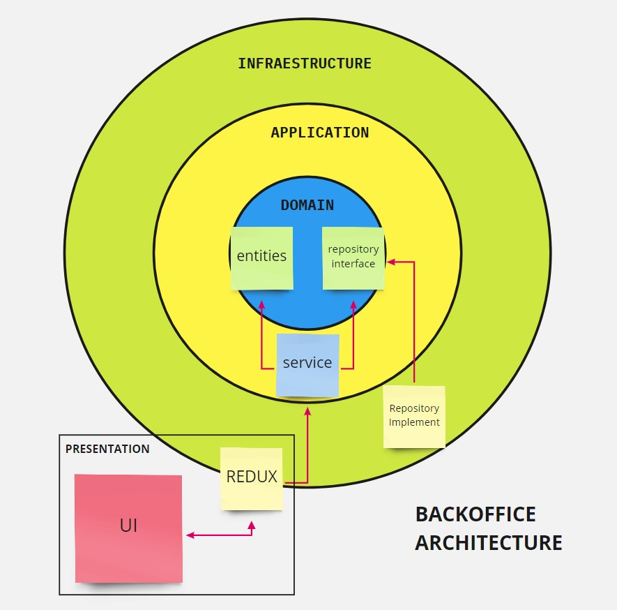
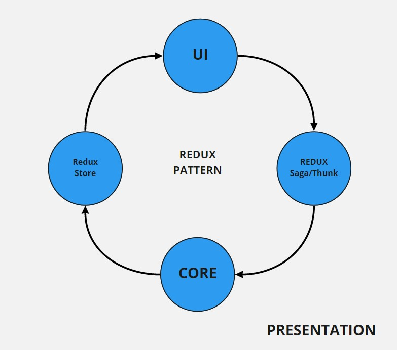

# BackOffice

Repositorio para el nuevo BackOffice.

## Arquitectura

Arquitectura basada en **CLEAN Architecture**, así como las buenas prácticas de programación y uso de los principios **SOLID** en la medida de lo posible.

| Capa            | Definición                                                                                                                                                                                                 |
| --------------- | ---------------------------------------------------------------------------------------------------------------------------------------------------------------------------------------------------------- |
| domain          | Es la capa donde se encuentra las entidades que viajan por toda la aplicación. Además, acá se definirán las reglas de negocio y se abstraerán interfaces para los repositorios.                            |
| application     | Esta capa contiene interfaces que validan las reglas de negocio y también ocultan la implementación de los repositorios hacia REDUX a través de la inyección de dependencias.                              |
| infraestructure | En esta capa se implementa la complejidad de los repositorios juntos con las diferentes fuentes de datos presentes para este proyecto.                                                                     |
| presentation    | Acá se encuentran todas las pantallas y componentes de cada uno de los módulos. Para el control de estados usamos el patrón REDUX junto con REDUX SAGA el cual apoyará en el manejo de estados asíncronos. |

Conceptos a considerar:

- Inyección de dependencias
- Responsabilidad única
- Pruebas unitarias
